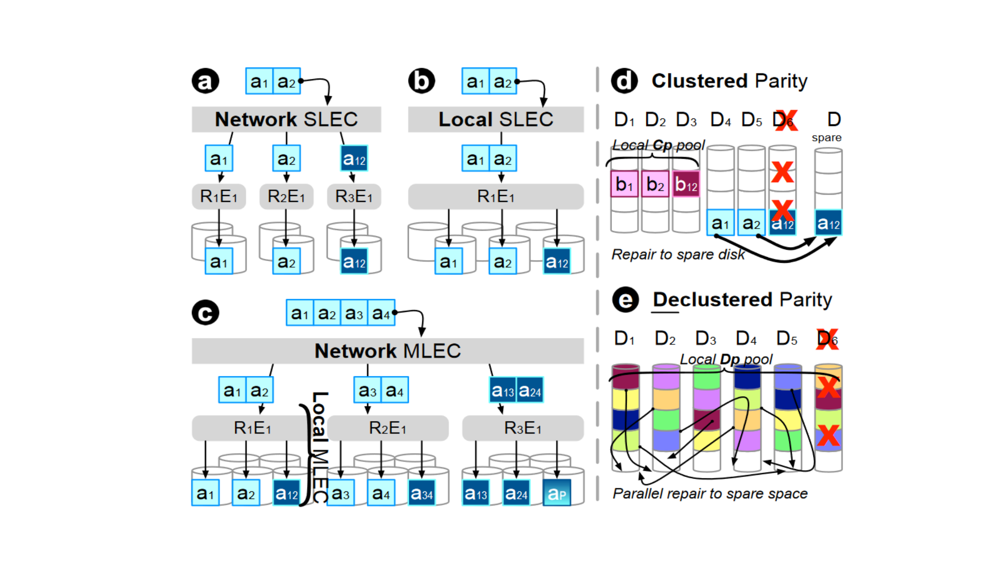

---

##### Download

+ [PDF](https://ucare.cs.uchicago.edu/pdf/sc23-mlec.pdf)
+ [Code(MLEC Simulator)](https://github.com/ucare-uchicago/mlec-sim)
+ [ACM Library](https://dl.acm.org/doi/10.1145/3581784.3607072)

---

##### Abstract

Multi-level erasure coding (MLEC) has seen large deployments in the field, but there is no in-depth study of design considerations for MLEC at scale. In this paper, we provide comprehensive design considerations and analysis of MLEC at scale. We introduce the design space of MLEC in multiple dimensions, including various code parameter selections, chunk placement schemes, and various repair methods. We quantify their performance and durability, and show which MLEC schemes and repair methods can provide the best tolerance against independent/correlated failures and reduce repair network traffic by orders of magnitude. To achieve this, we use various evaluation strategies including simulation, splitting, dynamic programming, and mathematical modeling. We also compare the performance and durability of MLEC with other EC schemes such as SLEC and LRC and show that MLEC can provide high durability with higher encoding throughput and less repair network traffic over both SLEC and LRC.

---

##### MLEC vs SLEC parity calculation and placement



---

##### Citation

```BibTeX
@inproceedings{10.1145/3581784.3607072,
author = {Wang, Meng and Mao, Jiajun and Rana, Rajdeep and Bent, John and Olmez, Serkay and George, Anjus and Ransom, Garrett Wilson and Li, Jun and Gunawi, Haryadi S.},
title = {Design Considerations and Analysis of Multi-Level Erasure Coding in Large-Scale Data Centers},
year = {2023},
isbn = {9798400701092},
publisher = {Association for Computing Machinery},
address = {New York, NY, USA},
url = {https://doi.org/10.1145/3581784.3607072},
doi = {10.1145/3581784.3607072},
abstract = {Multi-level erasure coding (MLEC) has seen large deployments in the field, but there is no in-depth study of design considerations for MLEC at scale. In this paper, we provide comprehensive design considerations and analysis of MLEC at scale. We introduce the design space of MLEC in multiple dimensions, including various code parameter selections, chunk placement schemes, and various repair methods. We quantify their performance and durability, and show which MLEC schemes and repair methods can provide the best tolerance against independent/correlated failures and reduce repair network traffic by orders of magnitude. To achieve this, we use various evaluation strategies including simulation, splitting, dynamic programming, and mathematical modeling. We also compare the performance and durability of MLEC with other EC schemes such as SLEC and LRC and show that MLEC can provide high durability with higher encoding throughput and less repair network traffic over both SLEC and LRC.},
booktitle = {Proceedings of the International Conference for High Performance Computing, Networking, Storage and Analysis},
articleno = {47},
numpages = {13},
keywords = {data centers, HPC storage, system-design tradeoffs, scalable storage, reliability, data protection, erasure coding},
location = {Denver, CO, USA},
series = {SC '23}
}
```